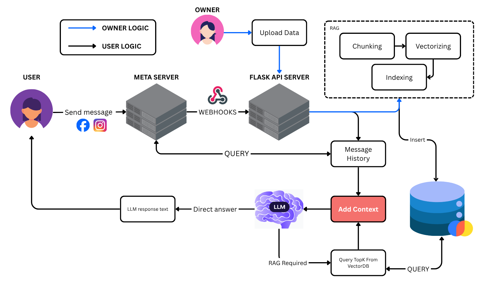

# Facebook Chatbot using gemini & Facebook webhook (customize for KNI.vn)

This is an AI-powered chatbot built for [KNI Education](https://kni.vn), a leading center for TestAS preparation and German study consultation in Vietnam. The chatbot integrates Google Gemini (via `google-genai`) with Facebook Messenger to provide friendly and informative responses to prospective students.




## 🚀 Features

- ✨ AI-based replies powered by **Gemini Pro (Google GenAI)**
- 💬 Facebook Messenger integration using webhook
- 🇻🇳 Vietnamese prompt customization
- ℹ️ RAG system for data using **ChromaDB**
- 🔒 Secure config management via `.env`
- 🌐 Deployable on **Render**, Railway, or VPS

---

## 🧱 Tech Stack

- `Flask` – lightweight web server
- `google-genai` – Gemini Pro access
- `python-dotenv` – environment variable management
- `Gunicorn` – WSGI server for production
- `Facebook Graph API` – for Messenger integration

---

## 🛠 Installation

1. **Clone the repo**
   ```bash
   git clone https://github.com/yourusername/facebook-chatbot.git
   cd facebook-chatbot
2. **Set up virtual environment**
   Create a .env file in the root directory:
   GEMINI_API_KEY=your-gemini-api-key
   VERIFY_TOKEN=your-verify-token
   PAGE_ACCESS_TOKEN=your-page-access-token
   INSTA_ACCESS_TOKEN=your-insta-token
   CHROMA_DB_PATH=chroma_db

3. **Install dependencies**
   Using uv (Fastest):
   ```bash
   uv venv
   source .venv/bin/activate
   uv pip install -r pyproject.toml

   Or using standard pip:

   pip install -r pyproject.toml

--- 

## ▶️ Local Development

Run the FastAPI development server with hot-reload:
```bash
   uvicorn app_fastapi:app --reload --port 8000
```
The server will start at http://localhost:8000.

API Endpoints
Webhook: GET/POST /webhook
Config UI: GET /config
Update Context (RAG): POST /update_context (Upload JSON file)

## 🌐 Webhook Verification (Facebook Setup)
```bash
   GET /webhook?hub.verify_token=kni-verify-token&hub.challenge=123456&hub.mode=subscribe
```

## 🐳 Docker Deployment
This project uses uv inside Docker for faster builds.

1. Build the image
   ```bash
   docker build -t facebook-chatbot .

2. Run the container
   Mount the chroma_db volume to persist RAG data and credentials for Google Sheets access.
   
   ```bash
   docker run -d \
   --name kni-chatbot \
   -p 8000:8000 \
   --env-file .env \
   -v $(pwd)/chroma_db:/app/chroma_db \
   -v $(pwd)/credentials:/app/credentials \
   facebook-chatbot


## 🤝 About KNI Education

KNI Education is a TestAS prep center helping Vietnamese students prepare for academic studies in Germany.
	•	95% pass rate for TestAS
	•	Expert tutor: ABB Robotics Engineer, 125/130 TestAS scorer
	•	Free resources: Core Test + Module
	•	Personalized support until goal is achieved

Visit: https://kni.vn
